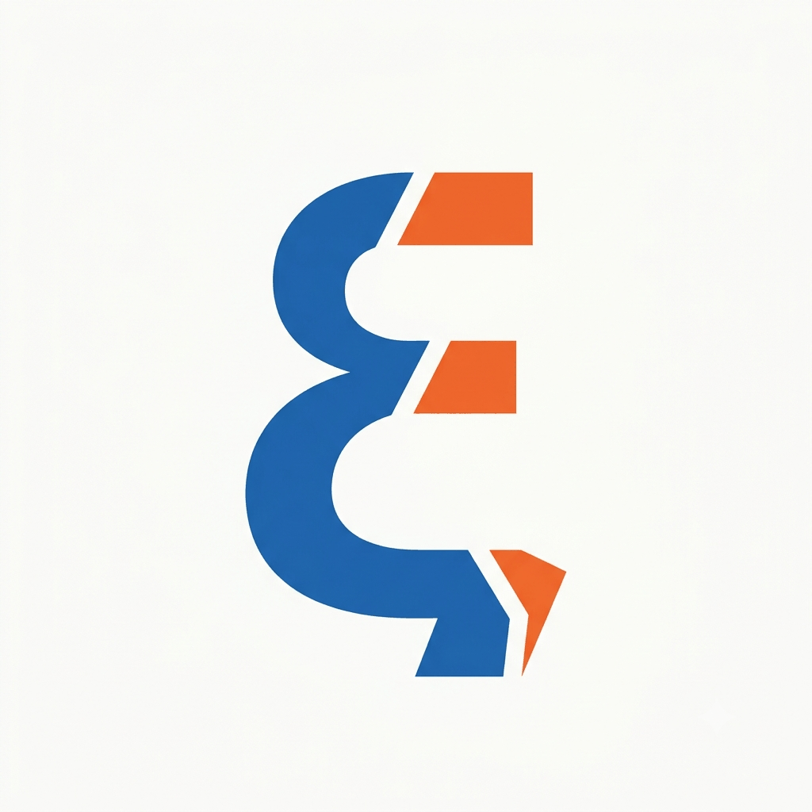

# ξύμβολον (xymbolon)

**囲い込みのないデジタル名刺入れ。選んで、渡すだけ。**
A walled-garden-free digital meishi wallet: pick a persona, hand it over.

> ⚠️ v0.10.0 実験中 / experimental. 生成AI使用・要検証 / AI-assisted; verify.

**▶ 使う / Use it: https://puretearsdropped.github.io/xymbolon/**
（インストール不要。スマホで開いて「ホーム画面に追加」するとアプリになります）

## 名前について / The name

**ξύμβολον**（シュンボロン・古アッティカ綴り）は古代ギリシャの割符。出会いの証に陶片を
二つに割り、互いに半分ずつ持ち帰った——後の「シンボル」の語源である。

> 「われわれ一人ひとりは、合う片割れを探し求める人間の割符（ξύμβολον）である」
> — プラトン『饗宴』191d

*The xymbolon was a token broken in two at a meeting, each party keeping half — the
ancestor of the word "symbol", and per Plato's Symposium, of us all.*

## 何をするか / What it does

- **ペルソナ（複数の顔）**を端末内に持つ：仕事・個人・匿名。各ペルソナは自由な (種類, 値)
  の束（メール・GitHub・ORCID・何でも）＋顔画像。名前なしの匿名運用も一級市民。
- **渡す**：ペルソナを選び「渡す」→ OS の共有シートへ vCard (.vcf) を投げる —
  iPhone 同士は **AirDrop**（iOS 17+ は共有シートを開いたまま端末を近づけると発火）、
  Android 同士は Quick Share / Bluetooth、陣営を跨ぐときは LocalSend 等。
- **交換の刻印**：渡す vCard の NOTE に「交換: 日付＋イベント名」を自動で刻む —
  受け取った側の連絡先に、いつどこで会ったかが残る（受け手にアプリは不要）。
- 受け取りは OS 標準機能だけで完結。**このアプリは送る側にしか要らない。**

## 憲法 / Constitution

1. **サーバなし・アカウントなし・同期なし** — データは端末の localStorage のみ
2. **非対称な参照** — 渡すのは一方向ポインタ。相互接続・通知・既読は作らない
3. **受け手の要求仕様ゼロ** — 受信は OS 標準の連絡先機能だけで成立
4. **解析ゼロ** — テレメトリなし・外部読込なし・単一 HTML ファイル
5. **0BSD** — fork・自己ホスト自由

## 使い方 / Usage

ホストされたページを開くだけ（または `index.html` をダウンロードして任意の https で
自己ホスト）。バックアップは画面下の JSON 書き出しで。詳しい手順はアプリ内の「？ 使い方」へ。

**相性のいい道具**: iOS ショートカット
[「QRコードを作成」](https://www.icloud.com/shortcuts/d201f94c176944ad97eb5b5fdffbada8)
を入れると、共有シートから QR 表示（相手に読ませる渡し方）が使えます —
共有シートに投げるだけの設計なので、こういう拡張が外から自由に足せます。

## Art

アイコン原画（噛み合う割符）: Gemini ／ ξ ロゴ: ChatGPT ／ 選定と組み込み: 人間と Claude。
Icon art (interlocking token halves) by Gemini; ξ logotype by ChatGPT.

## License

Zero-Clause BSD (0BSD). Do whatever you want.
